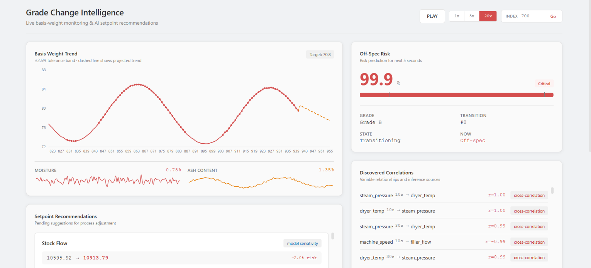

# Grade Change Intelligence

Predicts when basis weight is about to go off-spec during a grade change, recommends a
setpoint to pull it back, explains why, and tracks whether operators agreed with the call.

Built solo for Honeywell's Grade Change Intelligence hackathon challenge, using a synthetic
paper-machine dataset since no real mill data was available (see `simulator/`).


---

## Why this exists

Honeywell's QCS already runs coordinated grade changes in MD Control. It calculates
targets, ramps stock flow, filler, steam, and speed together, and does it far better than a
manual change. But it still just *executes*. It doesn't learn from past transitions, and it
can't tell a newer operator *why* a particular ramp is risky before the scanner shows
off-spec paper.

That's the gap the problem statement asks to fill: a layer that watches a grade change
happening, predicts basis-weight risk **before** it crosses the ±2.5% band, recommends a
setpoint to avoid it, and explains its reasoning, without replacing the actual MD controller.

## Problem Addressed

The problem statement has six fairly literal asks. Here's how each is covered:

| Ask | Where |
|---|---|
| Predict basis-weight off-spec risk before it happens | `models/train_risk_model.py` → `risk_model.pkl`, served at `GET /api/risk` |
| Recommend setpoints to stay in safe limits | `models/setpoint_recommender.py`, served at `GET /api/recommendations` |
| Reduce stabilization time | `closed_loop/replay_demo.py`, which replays a transition with and without the recommendations applied |
| Rationale behind every prediction/recommendation | `models/rationale_templates.py`, a plain-language sentence per suggestion |
| Find correlations, including ones not in the recipe sheet | `models/correlation_discovery.py` → `correlations.json`, `GET /api/correlations` |
| Tag every suggestion with a source, let a user accept/reject, log it | the `source` field on each suggestion, `feedback/feedback_store.py`, and `POST /api/recommendations/{id}/decision` |

## Project structure

```
grade-change-intelligence/
├── simulator/
│   ├── paper_machine_simulator.py
│   └── notebooks/
│       └── Paper_Machine_Simulator.ipynb
│
├── data/
│   ├── raw/
│   │   └── paper_making_dataset.csv
│   ├── processed/
│   │   └── features.csv
│   └── recipes/
│       └── grade_recipes.json
│
├── features/
│   └── feature_engineering.py
│
├── models/
│   ├── train_risk_model.py
│   ├── correlation_discovery.py
│   ├── setpoint_recommender.py
│   ├── rationale_templates.py
│   └── artifacts/
│       ├── risk_model.pkl
│       ├── feature_importances.json
│       ├── evaluation_report.json
│       ├── correlations.json
│       └── recommendations.json
│
├── feedback/
│   ├── feedback_store.py
│   └── feedback_log.csv
│
├── closed_loop/
│   ├── replay_demo.py
│   ├── replay_results.json
│   └── trajectory_comparison.png
│
├── dashboard/
│   ├── backend/
│   │   ├── main.py
│   │   ├── schemas.py
│   │   └── routers/
│   │       ├── trend.py
│   │       ├── risk.py
│   │       ├── correlations.py
│   │       └── recommendations.py
│   └── frontend/
│       ├── package.json
│       ├── vite.config.js
│       └── src/
│           ├── App.jsx
│           ├── api.js
│           └── components/
│               ├── TrendView.jsx
│               ├── RiskPanel.jsx
│               ├── CorrelationPanel.jsx
│               └── RecommendationPanel.jsx
│
├── requirements.txt
└── README.md
```

## Getting started

### Prerequisites

- Python 3.10+
- Node 18+ (for the dashboard frontend)

### Quick start

The repo ships with pre-built artifacts (`data/processed/features.csv`,
`models/artifacts/*`, `feedback/feedback_log.csv`), so the dashboard runs end to end without
regenerating anything.

Set up and start the backend:

```bash
python -m venv venv
source venv/bin/activate
pip install -r requirements.txt
cd dashboard/backend
uvicorn main:app --reload --port 8001
```

On Windows, activate the virtual environment with `venv\Scripts\activate` instead.

In a second terminal, start the frontend:

```bash
cd dashboard/frontend
npm install
npm run dev
```

Open `http://localhost:5173`. Hit play, or type an index and hit **Go** to jump to a
transition (index `700` lands inside a Grade B transition that goes off-spec).


## API reference

| Endpoint | Description |
|---|---|
| `GET /api/health` | liveness check |
| `GET /api/trend?end_index=N` | sliding window of basis weight, moisture, and ash ending at row `N`, plus the ±2.5% control band and a short linear extrapolation |
| `GET /api/risk?end_index=N` | off-spec risk probability at row `N` from the trained model |
| `GET /api/correlations` | cross-correlation pairs, model-importance findings, and the per-scenario deviation summary |
| `GET /api/recommendations?status=pending` | suggestions filtered by status (`pending`, `accepted`, `rejected`, or `all`) |
| `POST /api/recommendations/{id}/decision` | body `{"decision": "accepted" or "rejected"}`, records the operator's call |
| `GET /api/accuracy` | share of evaluated suggestions where the process actually stayed in spec afterward |

The frontend's `api.js` points directly at `http://localhost:8001/api`, with no env file, so
if the backend port changes, update it there too.

## Key Findings

**Risk model.** XGBoost, predicting off-spec risk 5 seconds ahead. The original plan called
for a 30 second horizon, but off-spec streaks in this dataset run long enough that a 30
second window is almost never fully in spec, so the label degenerated to "always 1." Five
seconds keeps it meaningful.

| | Accuracy | F1 | ROC-AUC |
|---|---|---|---|
| Risk model | 98.8% | 0.993 | 0.999 |
| Persistence baseline (predict risk = current off-spec state) | 86.5% | 0.922 | - |

The baseline is already strong because risk is streaky by nature, which is why it's reported
alongside the model's number instead of on its own. Broken down by scenario, the model is
weakest on **Recipe Mismatch** transitions (98.5% accuracy) and strongest on **Aggressive
Operator** (99.1%), and Recipe Mismatch is also the scenario with the worst deviation in the
raw data, so that tracks.

**Correlation discovery.** 114 lagged variable pairs cleared the `|r| > 0.5` bar, excluding
the obvious recipe pairs like stock flow and basis weight. A few examples:

- `dryer_temp` 30s earlier → `moisture` now, r = -0.96
- `steam_pressure` 10s earlier → `filler_flow` now, r = 0.95
- `machine_speed` 10s earlier → `dryer_temp` now, r = -0.95

Grouping deviation by scenario surfaced its own finding: **Recipe Mismatch** transitions run
at about 25% average basis-weight deviation versus 11% for a Normal transition, roughly 2.3x
worse.

**Closed-loop replay.** The one replay checked in (`closed_loop/replay_results.json`, an
Aggressive Operator Grade A to Grade C transition) applies 3 filler-flow interventions but
lands on the same stabilization time and off-spec seconds as the raw run. The
recommendations were individually reasonable (correlation-backed, small, within recipe
bounds) but too small and too late to change the outcome here. Likely a delta-size and
timing issue in `setpoint_recommender.py` rather than a broken concept, but it's reported as
is rather than dressed up.

## Known gaps

- **Single scanner, single machine.** The simulator models one MD scanner's worth of
  variables. It doesn't cover cross-direction variation, multi-ply structure, or multiple
  scanners.
- **Historical-transition matching isn't implemented.** `historical_transition` is a valid
  `source` tag in the schema, but the recommender doesn't yet search past transitions for a
  similar one to base a suggestion on, so it's currently unused.

## Tech stack

- **Simulation:** NumPy, pandas
- **Modeling:** XGBoost, scikit-learn
- **Backend:** FastAPI, uvicorn
- **Frontend:** React + Vite, Recharts
- **Storage:** flat CSV and JSON files

--- 
